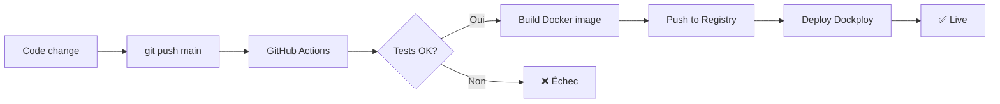

# DevOps - Docker & Dockploy - Documentation

Index de la documentation DevOps pour la containerisation et le déploiement de Sales Manager.

---

## 📚 Documents

### 1. **[SPEC_DEVOPS_DOCKER_DOCKPLOY.md](./SPEC_DEVOPS_DOCKER_DOCKPLOY.md)**
   **📖 Spec complète - Architecture et stratégie**

   Contient:
   - Architecture Docker (multi-stage build)
   - Configuration Dockploy complète
   - Gestion secrets et volumes
   - Stratégie backup et restauration
   - Monitoring et logs
   - CI/CD avec GitHub Actions
   - Environnements (dev/staging/prod)
   - Troubleshooting

### 2. **[../DEPLOYMENT_GUIDE.md](../DEPLOYMENT_GUIDE.md)**
   **🚀 Guide pratique - Quick start déploiement**

   Guide step-by-step:
   - Test local avec Docker
   - Déploiement Dockploy
   - Configuration secrets
   - Backup/restauration
   - Troubleshooting courant

---

## 🎯 Quick Start

### Test local immédiat

```bash
# 1. Copier .env.example
cp .env.example .env

# 2. Remplir vos API keys dans .env
nano .env

# 3. Lancer avec Docker Compose
docker-compose up --build

# 4. Accéder
open http://localhost:8501
```

### Déploiement production

```bash
# 1. Configurer Dockploy (une fois)
- Créer compte sur dockploy.com
- Connecter repo GitHub
- Ajouter secrets (HUBSPOT_API_KEY, etc.)
- Configurer domaine + SSL

# 2. Déployer
git push origin main
# Auto-deploy via GitHub Actions ✨
```

---

## 📦 Fichiers d'implémentation

Fichiers prêts à l'emploi créés avec la spec:

| Fichier | Description | Statut |
|---------|-------------|--------|
| `Dockerfile` | Build multi-stage optimisé | ✅ Prêt |
| `.dockerignore` | Exclure fichiers inutiles du build | ✅ Prêt |
| `docker-compose.yml` | Dev local avec hot reload | ✅ Prêt |
| `dockploy.json` | Config Dockploy (volumes, secrets, domain) | ✅ Prêt |
| `.github/workflows/deploy.yml` | CI/CD GitHub Actions | ✅ Prêt |
| `scripts/backup_databases.py` | Backup automatique SQLite | ✅ Prêt |

---

## 🏗️ Architecture

```
┌─────────────────────────────────────────┐
│          Dockploy (Orchestration)       │
│  - Auto-deploy sur git push             │
│  - SSL Let's Encrypt automatique        │
│  - Backup quotidien volumes             │
└─────────────────────────────────────────┘
                    │
                    ▼
┌─────────────────────────────────────────┐
│     Docker Container (sales-manager)    │
│  - Python 3.11 + Streamlit              │
│  - User non-root (sécurité)             │
│  - Health check intégré                 │
│  - Image ~600MB (multi-stage)           │
└─────────────────────────────────────────┘
                    │
                    ▼
┌─────────────────────────────────────────┐
│         Volumes Persistants             │
│  - /app/data (5GB) → DBs SQLite         │
│  - /app/logs (1GB) → Application logs   │
└─────────────────────────────────────────┘
```

---

## 🔐 Secrets Management

### ⚠️ JAMAIS commiter de secrets!

```bash
✅ .env.example (template) → Commiter
❌ .env (avec vraies valeurs) → JAMAIS commiter
✅ Secrets dans Dockploy → Chiffrés
✅ Secrets dans GitHub Actions → Chiffrés
```

### Configuration

**Local (dev):**
```bash
cp .env.example .env
# Éditer .env avec vos API keys
```

**Production (Dockploy):**
```
UI > Settings > Environment Variables > Add Secret
- HUBSPOT_API_KEY
- GETSALES_API_KEY
- PAPPERS_API_KEY
```

---

## 💾 Backup Strategy

### Automatique (Dockploy)

```json
{
  "backup": {
    "schedule": "0 2 * * *",  // 2h chaque jour
    "retention": 7,           // Garder 7 jours
    "volumes": ["data"]
  }
}
```

### Manuel

```bash
# Backup
python scripts/backup_databases.py

# Ou depuis container
dockploy exec sales-manager -- python scripts/backup_databases.py

# Stats backups
python scripts/backup_databases.py --action stats

# Restaurer
python scripts/backup_databases.py --action restore --db-name leads
```

---

## 🌍 Environnements

| Env | Branche | URL | Auto-deploy | Resources |
|-----|---------|-----|-------------|-----------|
| **Dev** | develop | localhost:8501 | Non | Local |
| **Staging** | staging | staging.sales.geniefactory.com | Oui | 512MB RAM |
| **Prod** | main | sales.geniefactory.com | Oui | 1GB RAM |

---

## 🚀 Workflow déploiement



**Timeline:**
- Tests: ~2 min
- Build Docker: ~3 min
- Deploy: ~1 min
- **Total: ~6 min** du push au déploiement

---

## 📊 Métriques

### Build Docker

- **Taille image:** ~600MB (multi-stage)
- **Build time:** ~3 min (avec cache)
- **Build time:** ~5 min (sans cache)

### Runtime

- **Memory usage:** 200-400MB (idle)
- **Memory usage:** 400-800MB (sous charge)
- **Startup time:** ~20 sec
- **Health check:** 30 sec après start

---

## ✅ Checklist mise en production

### Avant premier déploiement

- [ ] Dockerfile testé localement
- [ ] docker-compose fonctionne
- [ ] Tests passent
- [ ] Secrets configurés dans Dockploy
- [ ] Domaine DNS configuré
- [ ] SSL activé (Let's Encrypt)
- [ ] Backup quotidien configuré
- [ ] GitHub Actions secrets ajoutés (DOCKPLOY_TOKEN)

### Post-déploiement

- [ ] Health check OK
- [ ] App accessible via HTTPS
- [ ] Login fonctionne
- [ ] Sync HubSpot teste
- [ ] Logs sans erreur
- [ ] Volumes persistants vérifiés
- [ ] Backup testé
- [ ] Rollback testé

---

## 🔧 Commandes utiles

### Docker local

```bash
# Build
docker-compose build

# Lancer
docker-compose up

# Logs
docker-compose logs -f

# Arrêter
docker-compose down

# Cleanup
docker system prune -a
```

### Dockploy

```bash
# Logs
dockploy logs sales-manager --follow

# Stats
dockploy stats sales-manager

# Exec commande
dockploy exec sales-manager -- ls /app/data

# Redémarrer
dockploy restart sales-manager

# Backup manuel
dockploy exec sales-manager -- python scripts/backup_databases.py
```

---

## 📞 Support

**Questions sur Docker:**
- [Documentation Docker](https://docs.docker.com/)
- [Streamlit Docker](https://docs.streamlit.io/knowledge-base/tutorials/deploy/docker)

**Questions sur Dockploy:**
- [Documentation Dockploy](https://docs.dockploy.com/)
- [Discord Dockploy](https://discord.gg/dockploy)

**Bugs applicatifs:**
- Vérifier logs: `dockploy logs sales-manager`
- Ouvrir issue GitHub

---

## 🎓 Pour aller plus loin

### Optimisations futures

- [ ] CDN pour assets statiques
- [ ] Redis pour cache session
- [ ] Prometheus + Grafana monitoring
- [ ] Log aggregation (Loki, ELK)
- [ ] Load balancer (si multi-instances)
- [ ] Database replication (si croissance)

### Sécurité

- [ ] Scan vulnérabilités image (Trivy, Snyk)
- [ ] Secrets rotation automatique
- [ ] Network policies
- [ ] Rate limiting
- [ ] WAF (Web Application Firewall)

---

**Version:** 1.0
**Date:** 2025-12-21
**Statut:** READY - Prêt pour implémentation
